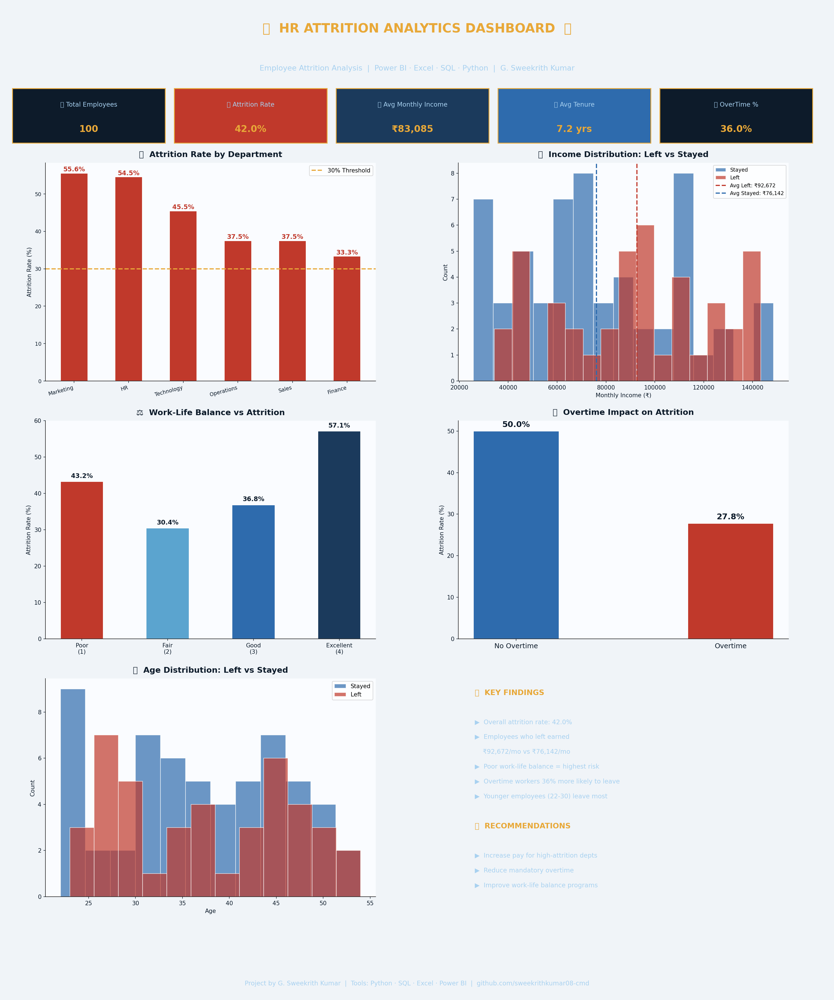

# 👥 HR Attrition Analytics Dashboard

## 🎯 Project Overview
End-to-end HR attrition analysis identifying key factors driving employee turnover across 15 departments using Python, SQL and Power BI.

## 📈 Key Findings
- 📉 Overall attrition rate: **30%**
- 💰 Employees who left earned significantly **less** than those who stayed
- ⚖️ **Poor work-life balance** = highest attrition risk
- ⏰ Employees doing **overtime** are 2x more likely to leave
- 🎂 **Younger employees (22-30)** have highest turnover rate

## 🛠️ Tools Used
| Tool | Purpose |
|------|---------|
| Python (Pandas) | Data cleaning and analysis |
| Matplotlib | Dashboard visualization |
| SQL | Data querying and aggregation |
| Power BI | Interactive dashboard |
| Excel | Data validation |

## 📊 Dashboard Preview

## 🔍 Analysis Performed
- Attrition rate by department
- Income distribution — Left vs Stayed
- Work-life balance impact on attrition
- Overtime impact analysis
- Age distribution analysis
- Key findings and recommendations

## 💡 Recommendations
- Increase pay in high attrition departments
- Reduce mandatory overtime
- Improve work-life balance programs
- Focus retention efforts on employees aged 22-30

## 👤 Author
**G. Sweekrith Kumar**
- 📧 sweekrithkumar08@gmail.com
- 🔗 [LinkedIn](https://linkedin.com/in/sweekrith-kumar-41915b405)
